# UML Activity Diagram Fitur JiwaSehat

Diagram ini memakai UML activity diagram dengan swimlane pelaku, node awal/akhir, aktivitas, percabangan, dan aliran kontrol seperti contoh diagram aktivitas. Gambar SVG tiap diagram dapat dibuka langsung di Obsidian tanpa plugin. Kode PlantUML di bawah adalah sumber yang dapat disunting; alur dan celah implementasi dijelaskan di [[FEATURE_FLOWS]]. Revisi aturan terakhir: 21 Oktober 2026. Diagram mencakup flow target backend; status implementasi prototype dijelaskan pada FEATURE_FLOWS.

## 1. Landing Page dan Katalog

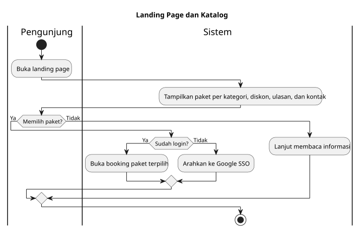

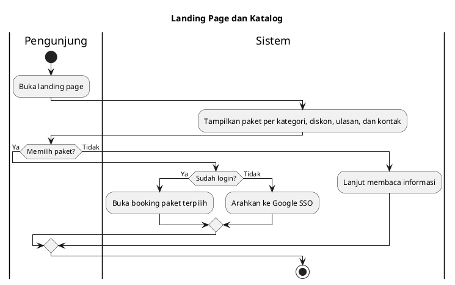
```plantuml
@startuml
title Landing Page dan Katalog
|Pengunjung|
start
:Buka landing page;
|Sistem|
:Tampilkan paket per kategori, diskon, ulasan, dan kontak;
|Pengunjung|
if (Memilih paket?) then (Ya)
  |Sistem|
  if (Sudah login?) then (Ya)
    :Buka booking paket terpilih;
  else (Tidak)
    :Arahkan ke Google SSO;
  endif
else (Tidak)
  :Lanjut membaca informasi;
endif
stop
@enduml
```

## 2. Login Google dan Registrasi

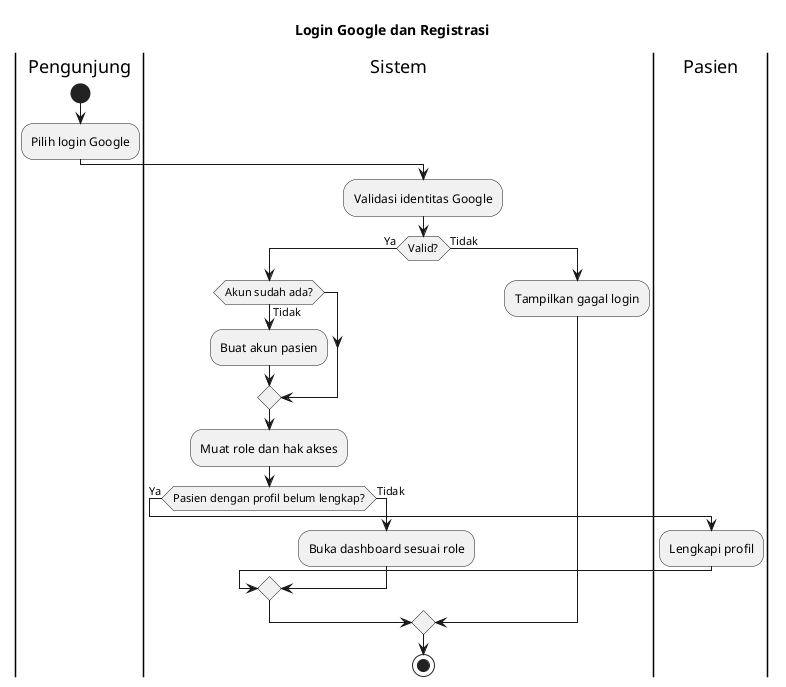
```plantuml
@startuml
title Login Google dan Registrasi
|Pengunjung|
start
:Pilih login Google;
|Sistem|
:Validasi identitas Google;
if (Valid?) then (Ya)
  if (Akun sudah ada?) then (Tidak)
    :Buat akun pasien;
  endif
  :Muat role dan hak akses;
  if (Pasien dengan profil belum lengkap?) then (Ya)
    |Pasien|
    :Lengkapi profil;
  else (Tidak)
    |Sistem|
    :Buka dashboard sesuai role;
  endif
else (Tidak)
  :Tampilkan gagal login;
endif
stop
@enduml
```

## 3. Kelengkapan Profil

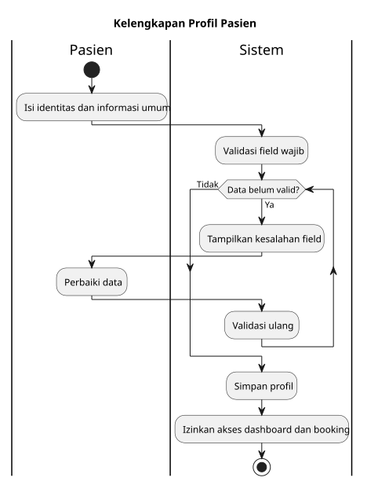

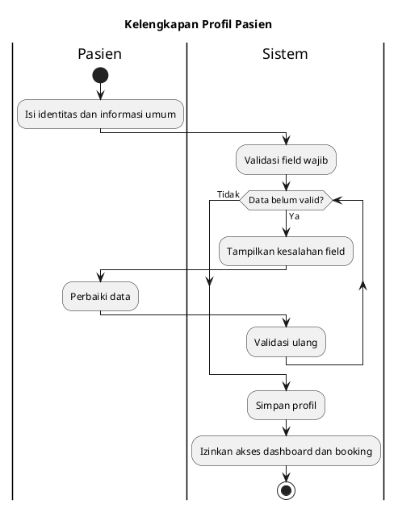
```plantuml
@startuml
title Kelengkapan Profil Pasien
|Pasien|
start
:Isi identitas dan informasi umum;
|Sistem|
:Validasi field wajib;
while (Data belum valid?) is (Ya)
  :Tampilkan kesalahan field;
  |Pasien|
  :Perbaiki data;
  |Sistem|
  :Validasi ulang;
endwhile (Tidak)
:Simpan profil;
:Izinkan akses dashboard dan booking;
stop
@enduml
```

## 4. Hak Akses Dashboard

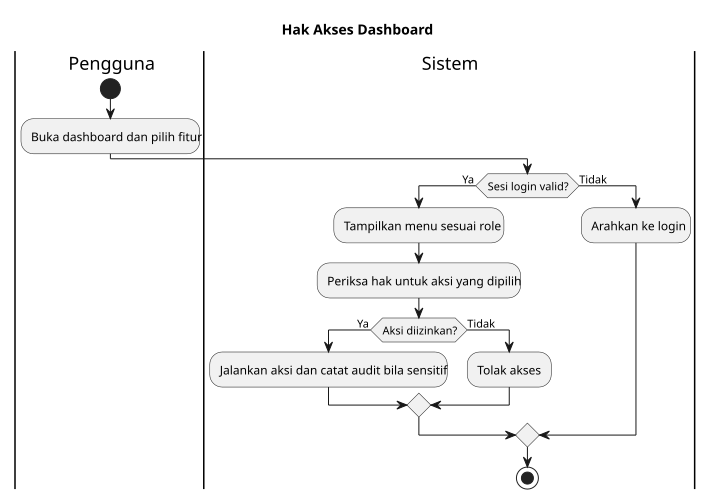

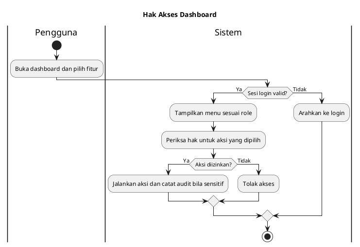
```plantuml
@startuml
title Hak Akses Dashboard
|Pengguna|
start
:Buka dashboard dan pilih fitur;
|Sistem|
if (Sesi login valid?) then (Ya)
  :Tampilkan menu sesuai role;
  :Periksa hak untuk aksi yang dipilih;
  if (Aksi diizinkan?) then (Ya)
    :Jalankan aksi dan catat audit bila sensitif;
  else (Tidak)
    :Tolak akses;
  endif
else (Tidak)
  :Arahkan ke login;
endif
stop
@enduml
```

## 5. Paket, Tarif, Diskon, dan Catatan

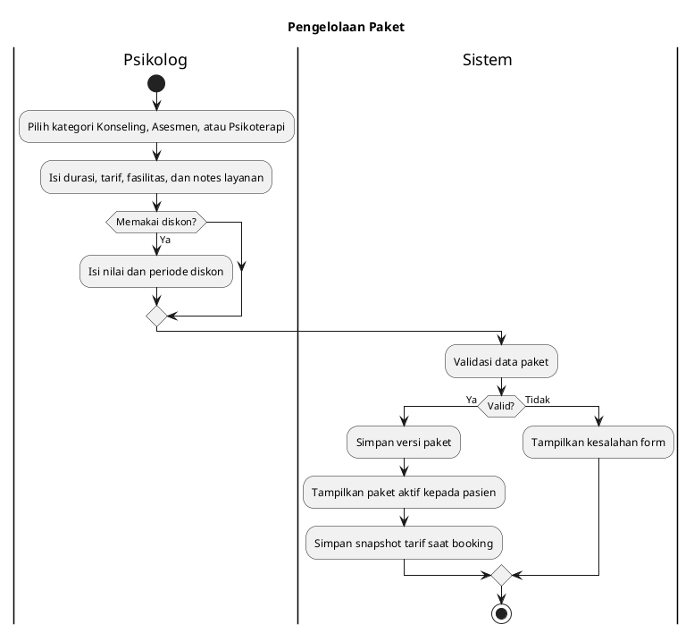
```plantuml
@startuml
title Pengelolaan Paket
|Psikolog|
start
:Pilih kategori Konseling, Asesmen, atau Psikoterapi;
:Isi durasi, tarif, fasilitas, dan notes layanan;
if (Memakai diskon?) then (Ya)
  :Isi nilai dan periode diskon;
endif
|Sistem|
:Validasi data paket;
if (Valid?) then (Ya)
  :Simpan versi paket;
  :Tampilkan paket aktif kepada pasien;
  :Simpan snapshot tarif saat booking;
else (Tidak)
  :Tampilkan kesalahan form;
endif
stop
@enduml
```

## 6. Jam Kerja dan Ketersediaan Slot

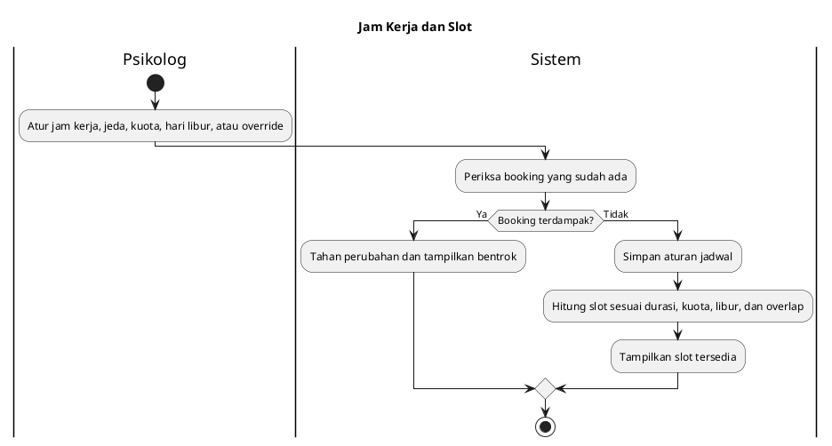
```plantuml
@startuml
title Jam Kerja dan Slot
|Psikolog|
start
:Atur jam kerja, jeda, kuota, hari libur, atau override;
|Sistem|
:Periksa booking yang sudah ada;
if (Booking terdampak?) then (Ya)
  :Tahan perubahan dan tampilkan bentrok;
else (Tidak)
  :Simpan aturan jadwal;
  :Hitung slot sesuai durasi, kuota, libur, dan overlap;
  :Tampilkan slot tersedia;
endif
stop
@enduml
```

## 7. Booking Mandiri

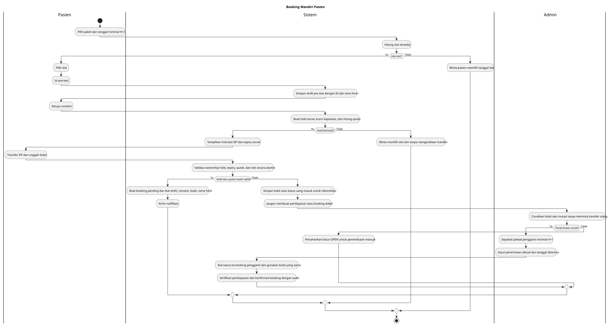

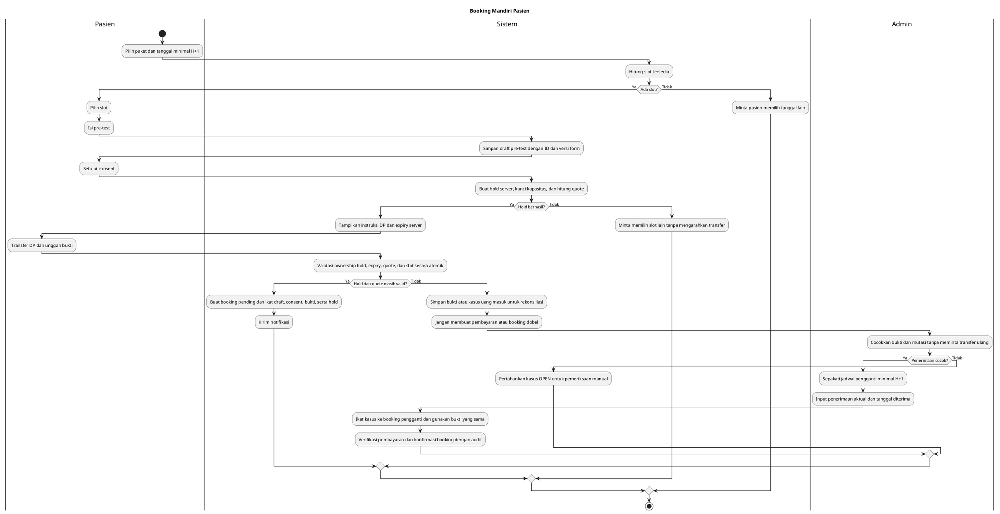
```plantuml
@startuml
title Booking Mandiri Pasien
|Pasien|
start
:Pilih paket dan tanggal minimal H+1;
|Sistem|
:Hitung slot tersedia;
if (Ada slot?) then (Ya)
  |Pasien|
  :Pilih slot;
  :Isi pre-test;
  |Sistem|
  :Simpan draft pre-test dengan ID dan versi form;
  |Pasien|
  :Setujui consent;
  |Sistem|
  :Buat hold server, kunci kapasitas, dan hitung quote;
  if (Hold berhasil?) then (Ya)
    :Tampilkan instruksi DP dan expiry server;
    |Pasien|
    :Transfer DP dan unggah bukti;
    |Sistem|
    :Validasi ownership hold, expiry, quote, dan slot secara atomik;
    if (Hold dan quote masih valid?) then (Ya)
      :Buat booking pending dan ikat draft, consent, bukti, serta hold;
      :Kirim notifikasi;
    else (Tidak)
      :Simpan bukti atau kasus uang masuk untuk rekonsiliasi;
      :Jangan membuat pembayaran atau booking dobel;
      |Admin|
      :Cocokkan bukti dan mutasi tanpa meminta transfer ulang;
      if (Penerimaan cocok?) then (Ya)
        :Sepakati jadwal pengganti minimal H+1;
        :Input penerimaan aktual dan tanggal diterima;
        |Sistem|
        :Ikat kasus ke booking pengganti dan gunakan bukti yang sama;
        :Verifikasi pembayaran dan konfirmasi booking dengan audit;
      else (Tidak)
        |Sistem|
        :Pertahankan kasus OPEN untuk pemeriksaan manual;
      endif
      |Sistem|
    endif
  else (Tidak)
    :Minta memilih slot lain tanpa mengarahkan transfer;
  endif
else (Tidak)
  :Minta pasien memilih tanggal lain;
endif
stop
@enduml
```

## 8. Pre-Test Profiling

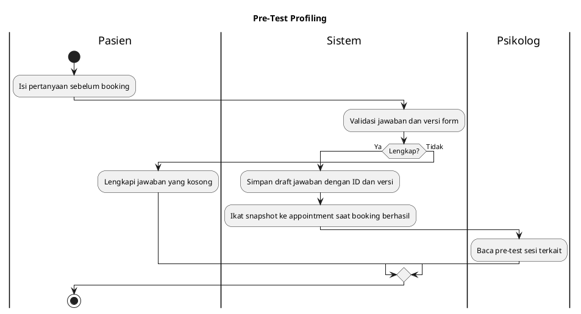
```plantuml
@startuml
title Pre-Test Profiling
|Pasien|
start
:Isi pertanyaan sebelum booking;
|Sistem|
:Validasi jawaban dan versi form;
if (Lengkap?) then (Ya)
  :Simpan draft jawaban dengan ID dan versi;
  :Ikat snapshot ke appointment saat booking berhasil;
  |Psikolog|
  :Baca pre-test sesi terkait;
else (Tidak)
  |Pasien|
  :Lengkapi jawaban yang kosong;
endif
stop
@enduml
```

## 9. Consent dan Privasi

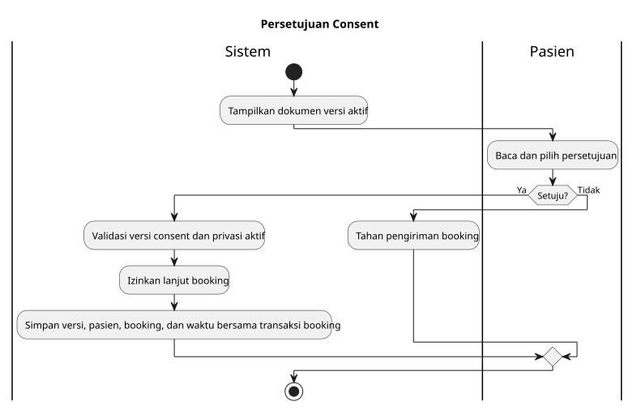

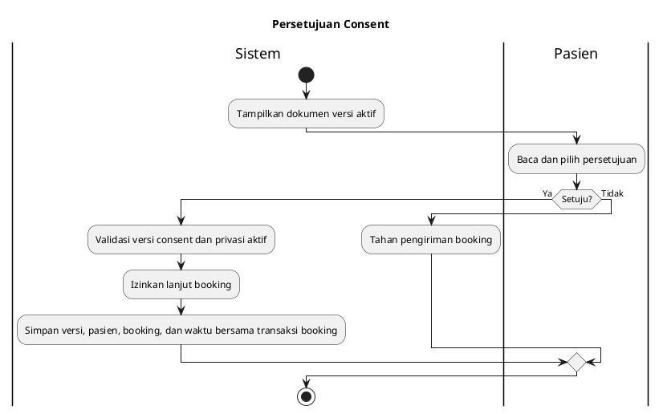
```plantuml
@startuml
title Persetujuan Consent
|Sistem|
start
:Tampilkan dokumen versi aktif;
|Pasien|
:Baca dan pilih persetujuan;
if (Setuju?) then (Ya)
  |Sistem|
  :Validasi versi consent dan privasi aktif;
  :Izinkan lanjut booking;
  :Simpan versi, pasien, booking, dan waktu bersama transaksi booking;
else (Tidak)
  |Sistem|
  :Tahan pengiriman booking;
endif
stop
@enduml
```

## 10. Verifikasi DP

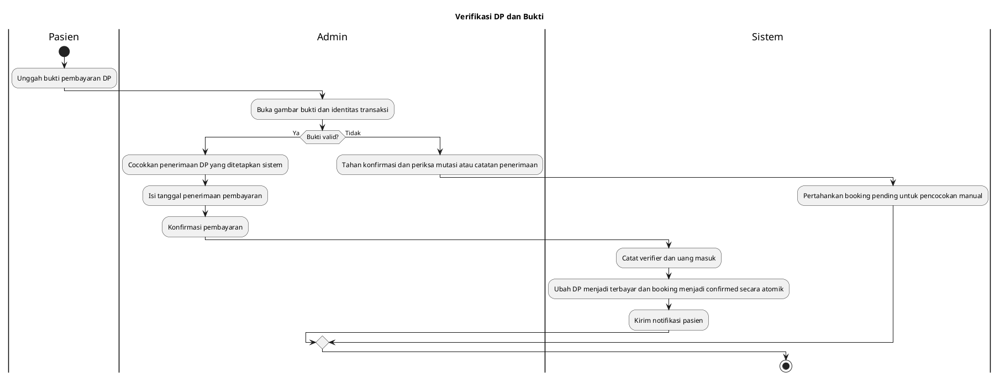
```plantuml
@startuml
title Verifikasi DP dan Bukti
|Pasien|
start
:Unggah bukti pembayaran DP;
|Admin|
:Buka gambar bukti dan identitas transaksi;
if (Bukti valid?) then (Ya)
  :Cocokkan penerimaan DP yang ditetapkan sistem;
  :Isi tanggal penerimaan pembayaran;
  :Konfirmasi pembayaran;
  |Sistem|
  :Catat verifier dan uang masuk;
  :Ubah DP menjadi terbayar dan booking menjadi confirmed secara atomik;
  :Kirim notifikasi pasien;
else (Tidak)
  |Admin|
  :Tahan konfirmasi dan periksa mutasi atau catatan penerimaan;
  |Sistem|
  :Pertahankan booking pending untuk pencocokan manual;
endif
stop
@enduml
```

## 11. Booking Walk-In

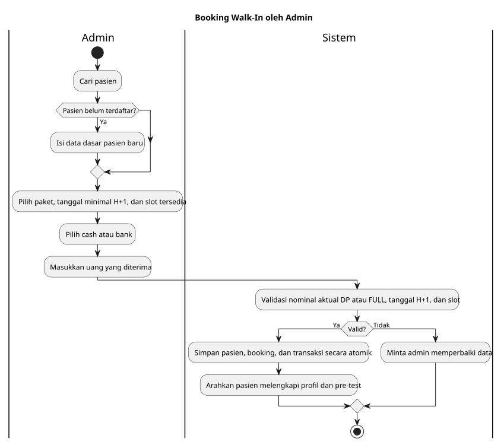

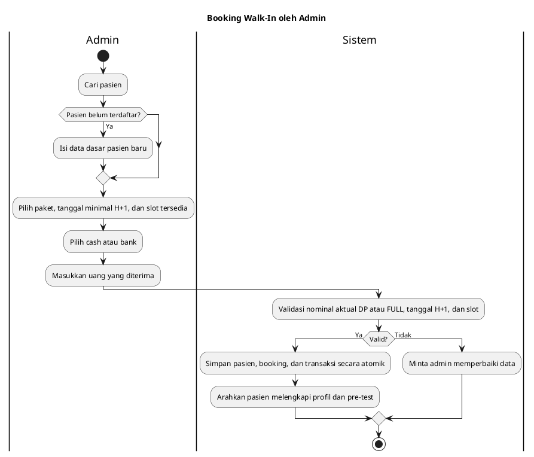
```plantuml
@startuml
title Booking Walk-In oleh Admin
|Admin|
start
:Cari pasien;
if (Pasien belum terdaftar?) then (Ya)
  :Isi data dasar pasien baru;
endif
:Pilih paket, tanggal minimal H+1, dan slot tersedia;
:Pilih cash atau bank;
:Masukkan uang yang diterima;
|Sistem|
:Validasi nominal aktual DP atau FULL, tanggal H+1, dan slot;
if (Valid?) then (Ya)
  :Simpan pasien, booking, dan transaksi secara atomik;
  :Arahkan pasien melengkapi profil dan pre-test;
else (Tidak)
  :Minta admin memperbaiki data;
endif
stop
@enduml
```

## 12. Reschedule

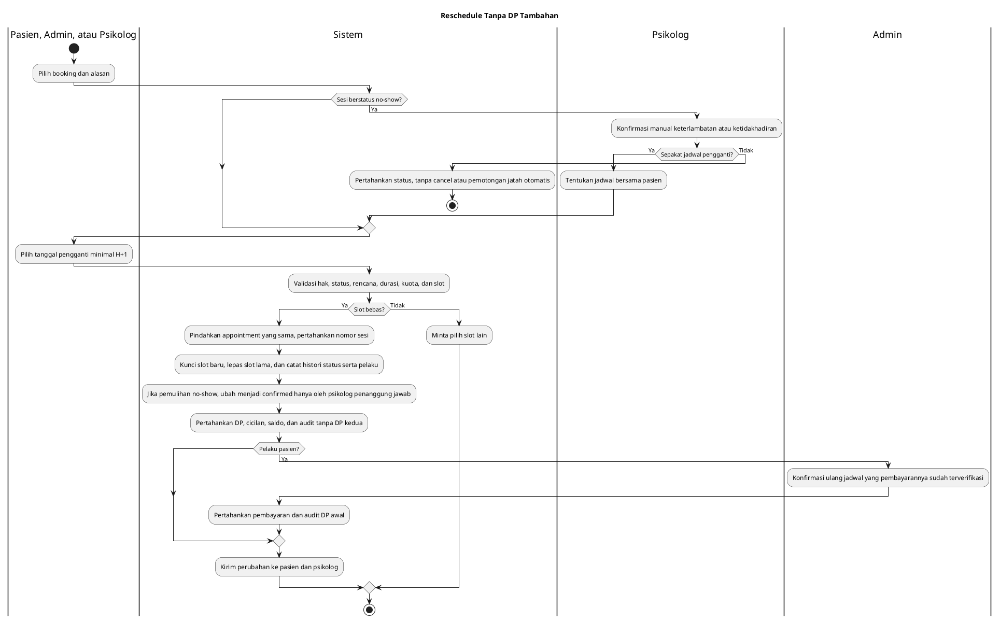
```plantuml
@startuml
title Reschedule Tanpa DP Tambahan
|Pasien, Admin, atau Psikolog|
start
:Pilih booking dan alasan;
|Sistem|
if (Sesi berstatus no-show?) then (Ya)
  |Psikolog|
  :Konfirmasi manual keterlambatan atau ketidakhadiran;
  if (Sepakat jadwal pengganti?) then (Ya)
    :Tentukan jadwal bersama pasien;
  else (Tidak)
    |Sistem|
    :Pertahankan status, tanpa cancel atau pemotongan jatah otomatis;
    stop
  endif
endif
|Pasien, Admin, atau Psikolog|
:Pilih tanggal pengganti minimal H+1;
|Sistem|
:Validasi hak, status, rencana, durasi, kuota, dan slot;
if (Slot bebas?) then (Ya)
  :Pindahkan appointment yang sama, pertahankan nomor sesi;
  :Kunci slot baru, lepas slot lama, dan catat histori status serta pelaku;
  :Jika pemulihan no-show, ubah menjadi confirmed hanya oleh psikolog penanggung jawab;
  :Pertahankan DP, cicilan, saldo, dan audit tanpa DP kedua;
  if (Pelaku pasien?) then (Ya)
    |Admin|
    :Konfirmasi ulang jadwal yang pembayarannya sudah terverifikasi;
    |Sistem|
    :Pertahankan pembayaran dan audit DP awal;
  endif
  |Sistem|
  :Kirim perubahan ke pasien dan psikolog;
else (Tidak)
  :Minta pilih slot lain;
endif
stop
@enduml
```

## 13. Pelaksanaan Konsultasi

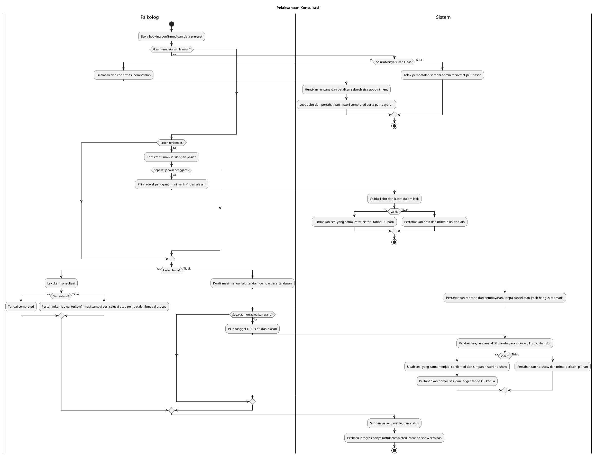
```plantuml
@startuml
title Pelaksanaan Konsultasi
|Psikolog|
start
:Buka booking confirmed dan data pre-test;
if (Akan membatalkan layanan?) then (Ya)
  |Sistem|
  if (Seluruh biaya sudah lunas?) then (Ya)
    |Psikolog|
    :Isi alasan dan konfirmasi pembatalan;
    |Sistem|
    :Hentikan rencana dan batalkan seluruh sisa appointment;
    :Lepas slot dan pertahankan histori completed serta pembayaran;
  else (Tidak)
    :Tolak pembatalan sampai admin mencatat pelunasan;
  endif
  stop
endif
|Psikolog|
if (Pasien terlambat?) then (Ya)
  :Konfirmasi manual dengan pasien;
  if (Sepakat jadwal pengganti?) then (Ya)
    :Pilih jadwal pengganti minimal H+1 dan alasan;
    |Sistem|
    :Validasi slot dan kuota dalam lock;
    if (Valid?) then (Ya)
      :Pindahkan sesi yang sama, catat histori, tanpa DP baru;
    else (Tidak)
      :Pertahankan data dan minta pilih slot lain;
    endif
    stop
  endif
endif
|Psikolog|
if (Pasien hadir?) then (Ya)
  :Lakukan konsultasi;
  if (Sesi selesai?) then (Ya)
    :Tandai completed;
  else (Tidak)
    :Pertahankan jadwal terkonfirmasi sampai sesi selesai atau pembatalan lunas diproses;
  endif
else (Tidak)
  :Konfirmasi manual lalu tandai no-show beserta alasan;
  |Sistem|
  :Pertahankan rencana dan pembayaran, tanpa cancel atau jatah hangus otomatis;
  |Psikolog|
  if (Sepakat menjadwalkan ulang?) then (Ya)
    :Pilih tanggal H+1, slot, dan alasan;
    |Sistem|
    :Validasi hak, rencana aktif, pembayaran, durasi, kuota, dan slot;
    if (Valid?) then (Ya)
      :Ubah sesi yang sama menjadi confirmed dan simpan histori no-show;
      :Pertahankan nomor sesi dan ledger tanpa DP kedua;
    else (Tidak)
      :Pertahankan no-show dan minta perbaiki pilihan;
    endif
  endif
endif
|Sistem|
:Simpan pelaku, waktu, dan status;
:Perbarui progres hanya untuk completed, catat no-show terpisah;
stop
@enduml
```

## 14. Pembayaran Bertahap

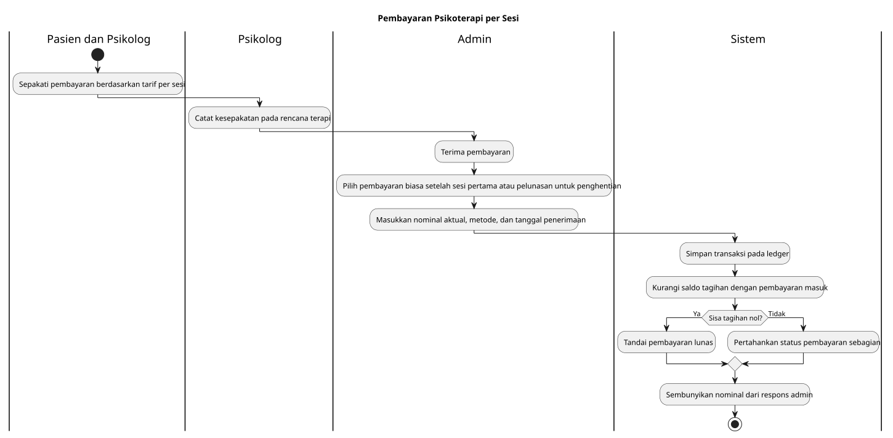

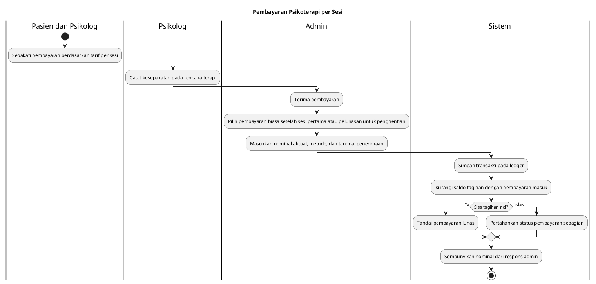
```plantuml
@startuml
title Pembayaran Psikoterapi per Sesi
|Pasien dan Psikolog|
start
:Sepakati pembayaran berdasarkan tarif per sesi;
|Psikolog|
:Catat kesepakatan pada rencana terapi;
|Admin|
:Terima pembayaran;
:Pilih pembayaran biasa setelah sesi pertama atau pelunasan untuk penghentian;
:Masukkan nominal aktual, metode, dan tanggal penerimaan;
|Sistem|
:Simpan transaksi pada ledger;
:Kurangi saldo tagihan dengan pembayaran masuk;
if (Sisa tagihan nol?) then (Ya)
  :Tandai pembayaran lunas;
else (Tidak)
  :Pertahankan status pembayaran sebagian;
endif
:Sembunyikan nominal dari respons admin;
stop
@enduml
```

## 15. Paket Berjalan dan Sesi Berikutnya

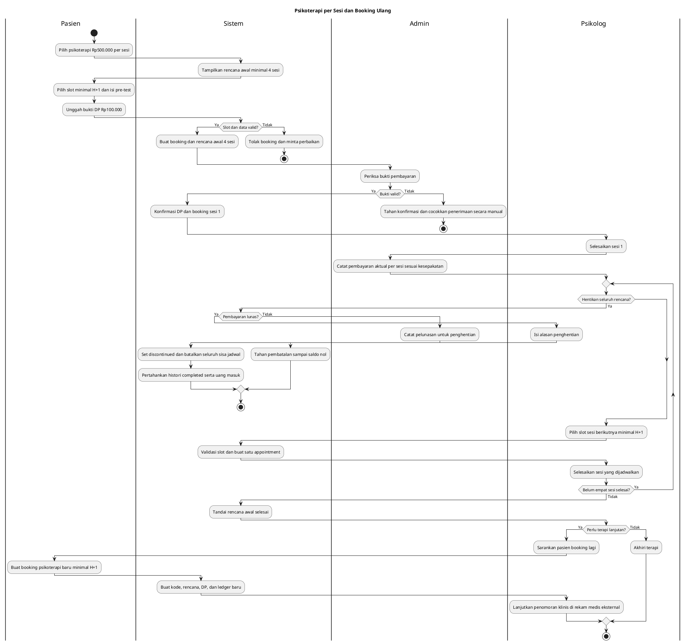
```plantuml
@startuml
title Psikoterapi per Sesi dan Booking Ulang
|Pasien|
start
:Pilih psikoterapi Rp500.000 per sesi;
|Sistem|
:Tampilkan rencana awal minimal 4 sesi;
|Pasien|
:Pilih slot minimal H+1 dan isi pre-test;
:Unggah bukti DP Rp100.000;
|Sistem|
if (Slot dan data valid?) then (Ya)
  :Buat booking dan rencana awal 4 sesi;
else (Tidak)
  :Tolak booking dan minta perbaikan;
  stop
endif
|Admin|
:Periksa bukti pembayaran;
if (Bukti valid?) then (Ya)
  |Sistem|
  :Konfirmasi DP dan booking sesi 1;
else (Tidak)
  |Admin|
  :Tahan konfirmasi dan cocokkan penerimaan secara manual;
  stop
endif
|Psikolog|
:Selesaikan sesi 1;
|Admin|
:Catat pembayaran aktual per sesi sesuai kesepakatan;
|Psikolog|
repeat
  |Psikolog|
  if (Hentikan seluruh rencana?) then (Ya)
    |Sistem|
    if (Pembayaran lunas?) then (Ya)
      |Psikolog|
      :Isi alasan penghentian;
      |Sistem|
      :Set discontinued dan batalkan seluruh sisa jadwal;
      :Pertahankan histori completed serta uang masuk;
    else (Tidak)
      |Admin|
      :Catat pelunasan untuk penghentian;
      |Sistem|
      :Tahan pembatalan sampai saldo nol;
    endif
    stop
  endif
  |Psikolog|
  :Pilih slot sesi berikutnya minimal H+1;
  |Sistem|
  :Validasi slot dan buat satu appointment;
  |Psikolog|
  :Selesaikan sesi yang dijadwalkan;
repeat while (Belum empat sesi selesai?) is (Ya) not (Tidak)
|Sistem|
:Tandai rencana awal selesai;
|Psikolog|
if (Perlu terapi lanjutan?) then (Ya)
  :Sarankan pasien booking lagi;
  |Pasien|
  :Buat booking psikoterapi baru minimal H+1;
  |Sistem|
  :Buat kode, rencana, DP, dan ledger baru;
  |Psikolog|
  :Lanjutkan penomoran klinis di rekam medis eksternal;
else (Tidak)
  :Akhiri terapi;
endif
stop
@enduml
```

## 16. Detail Pasien dan Data Klinis

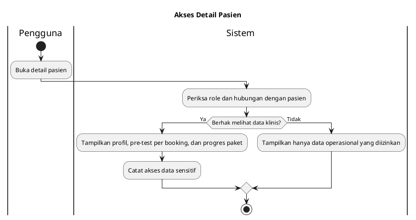
```plantuml
@startuml
title Akses Detail Pasien
|Pengguna|
start
:Buka detail pasien;
|Sistem|
:Periksa role dan hubungan dengan pasien;
if (Berhak melihat data klinis?) then (Ya)
  :Tampilkan profil, pre-test per booking, dan progres paket;
  :Catat akses data sensitif;
else (Tidak)
  :Tampilkan hanya data operasional yang diizinkan;
endif
stop
@enduml
```

## 17. Invoice dan Kwitansi

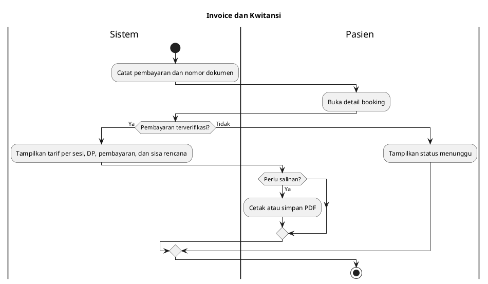
```plantuml
@startuml
title Invoice dan Kwitansi
|Sistem|
start
:Catat pembayaran dan nomor dokumen;
|Pasien|
:Buka detail booking;
|Sistem|
if (Pembayaran terverifikasi?) then (Ya)
  :Tampilkan tarif per sesi, DP, pembayaran, dan sisa rencana;
  |Pasien|
  if (Perlu salinan?) then (Ya)
    :Cetak atau simpan PDF;
  endif
else (Tidak)
  :Tampilkan status menunggu;
endif
stop
@enduml
```

## 18. Ulasan dan Moderasi

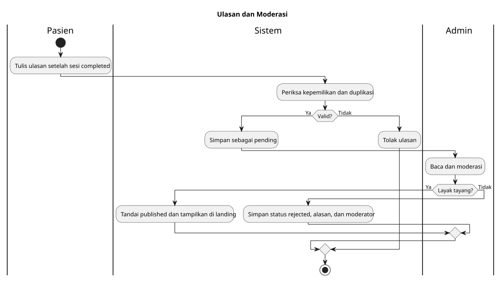

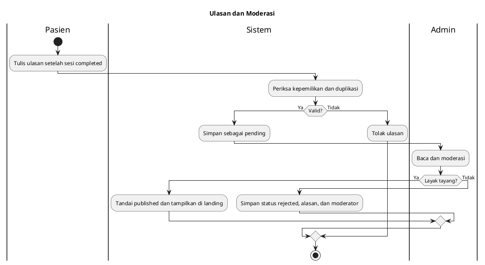
```plantuml
@startuml
title Ulasan dan Moderasi
|Pasien|
start
:Tulis ulasan setelah sesi completed;
|Sistem|
:Periksa kepemilikan dan duplikasi;
if (Valid?) then (Ya)
  :Simpan sebagai pending;
  |Admin|
  :Baca dan moderasi;
  if (Layak tayang?) then (Ya)
    |Sistem|
    :Tandai published dan tampilkan di landing;
  else (Tidak)
    |Sistem|
    :Simpan status rejected, alasan, dan moderator;
  endif
else (Tidak)
  :Tolak ulasan;
endif
stop
@enduml
```

## 19. CMS dan Media

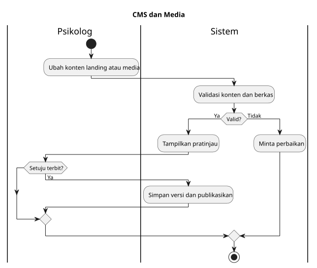

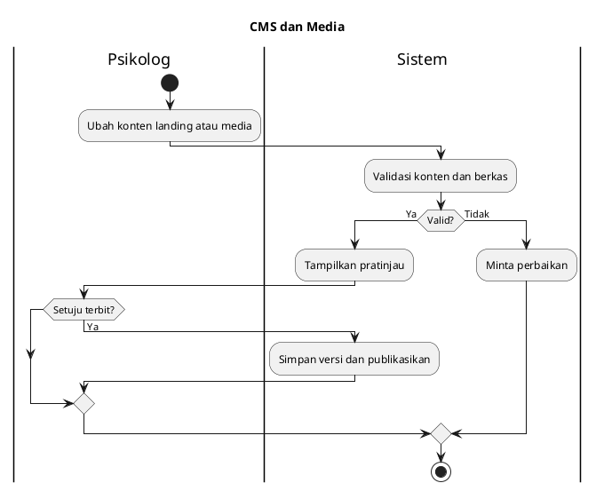
```plantuml
@startuml
title CMS dan Media
|Psikolog|
start
:Ubah konten landing atau media;
|Sistem|
:Validasi konten dan berkas;
if (Valid?) then (Ya)
  :Tampilkan pratinjau;
  |Psikolog|
  if (Setuju terbit?) then (Ya)
    |Sistem|
    :Simpan versi dan publikasikan;
  endif
else (Tidak)
  :Minta perbaikan;
endif
stop
@enduml
```

## 20. Laporan dan Ekspor Keuangan

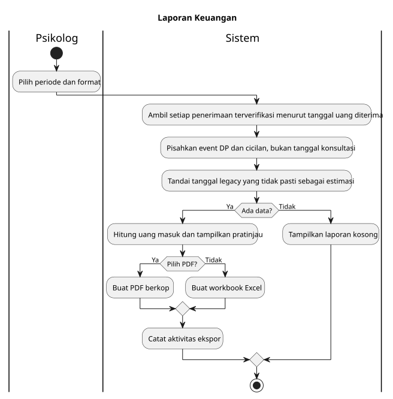

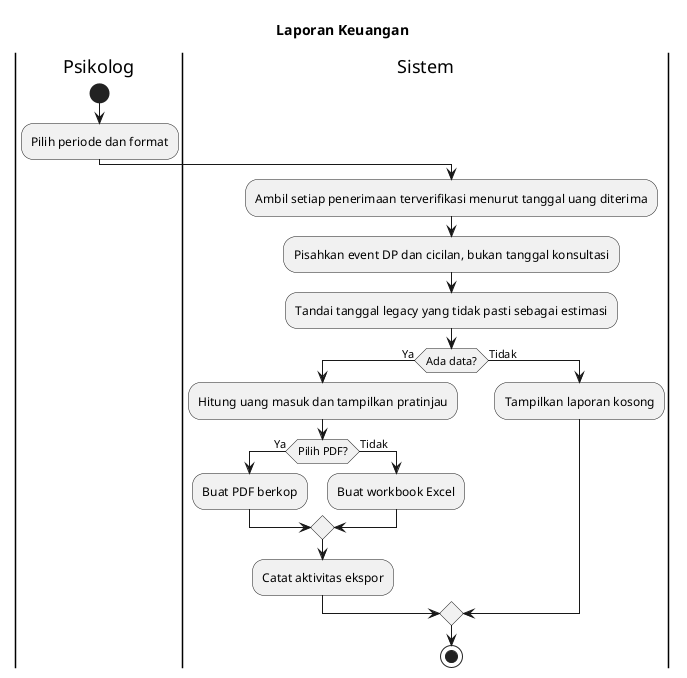
```plantuml
@startuml
title Laporan Keuangan
|Psikolog|
start
:Pilih periode dan format;
|Sistem|
:Ambil setiap penerimaan terverifikasi menurut tanggal uang diterima;
:Pisahkan event DP dan cicilan, bukan tanggal konsultasi;
:Tandai tanggal legacy yang tidak pasti sebagai estimasi;
if (Ada data?) then (Ya)
  :Hitung uang masuk dan tampilkan pratinjau;
  if (Pilih PDF?) then (Ya)
    :Buat PDF berkop;
  else (Tidak)
    :Buat workbook Excel;
  endif
  :Catat aktivitas ekspor;
else (Tidak)
  :Tampilkan laporan kosong;
endif
stop
@enduml
```

## 21. Backup dan Ekspor Data Klinis

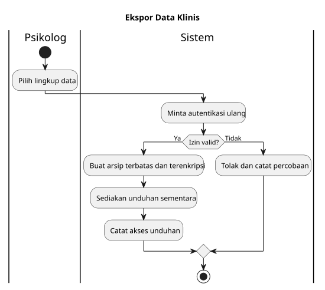

```plantuml
@startuml
title Ekspor Data Klinis
|Psikolog|
start
:Pilih lingkup data;
|Sistem|
:Minta autentikasi ulang;
if (Izin valid?) then (Ya)
  :Buat arsip terbatas dan terenkripsi;
  :Sediakan unduhan sementara;
  :Catat akses unduhan;
else (Tidak)
  :Tolak dan catat percobaan;
endif
stop
@enduml
```

## 22. Notifikasi WhatsApp

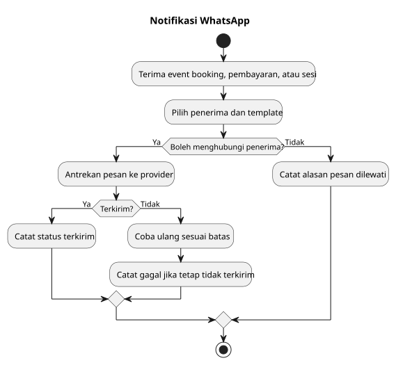

```plantuml
@startuml
title Notifikasi WhatsApp
|Sistem|
start
:Terima event booking, pembayaran, atau sesi;
:Pilih penerima dan template;
if (Boleh menghubungi penerima?) then (Ya)
  :Antrekan pesan ke provider;
  if (Terkirim?) then (Ya)
    :Catat status terkirim;
  else (Tidak)
    :Coba ulang sesuai batas;
    :Catat gagal jika tetap tidak terkirim;
  endif
else (Tidak)
  :Catat alasan pesan dilewati;
endif
stop
@enduml
```

## 23. Mobile, Navigasi, dan Error

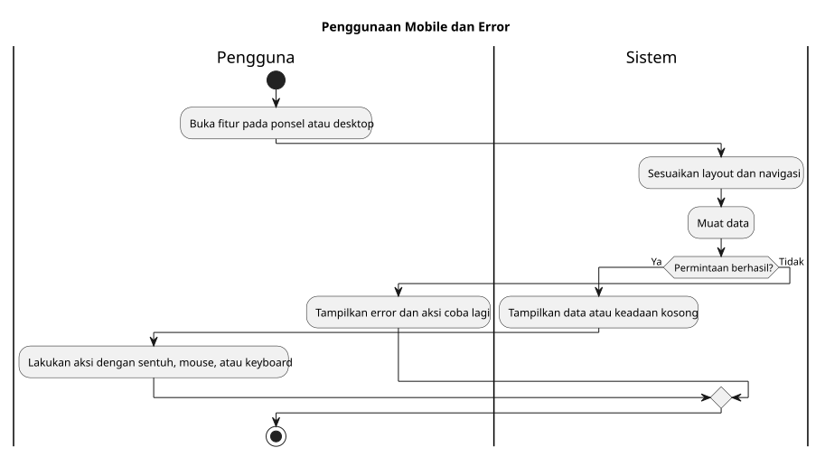

```plantuml
@startuml
title Penggunaan Mobile dan Error
|Pengguna|
start
:Buka fitur pada ponsel atau desktop;
|Sistem|
:Sesuaikan layout dan navigasi;
:Muat data;
if (Permintaan berhasil?) then (Ya)
  :Tampilkan data atau keadaan kosong;
  |Pengguna|
  :Lakukan aksi dengan sentuh, mouse, atau keyboard;
else (Tidak)
  :Tampilkan error dan aksi coba lagi;
endif
stop
@enduml
```

